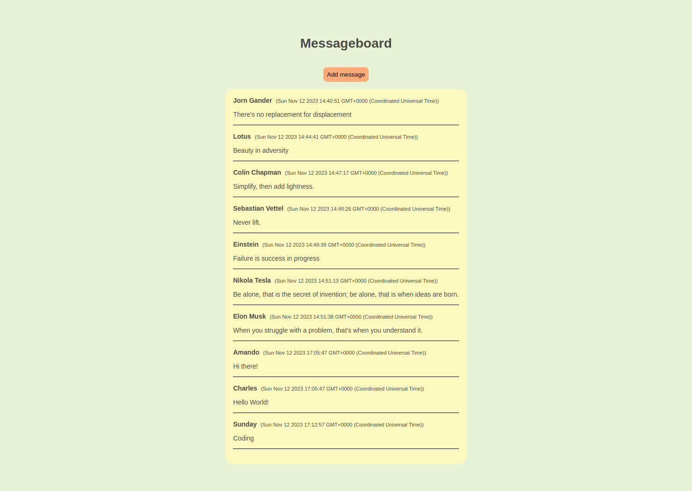

# Mini Message Board App

<a href="https://fragrant-sea-7011.fly.dev/"></a>

Live preview: https://fragrant-sea-7011.fly.dev/

## Table of Contents
* Introduction
* Features
* Installation
* Configuration
* Usage
* Technologies Used
* License

### Introduction
Welcome to the Message Board App! This application is built using Express, PugJS, CSS, and MongoDB, with private variables managed through an .env file. The app is designed to provide a simple and interactive platform for users to post messages, engage in discussions, and connect with others in a community setting.

### Features
* Create posts.
* MongoDB integration for data storage.
* Private variables management using an .env file.
* Deployment on Fly.io for scalability and reliability.

### Installation
To run the Message Board App locally, follow these steps:

Clone the repository:

```bash
git clone https://github.com/zakrnem/mini-message-board.git
```
Navigate to the project directory:

```bash
cd mini-message-board
```

Install dependencies:

```bash
npm install
```
### Configuration
Create a .env file in the root directory of the project.

Add the following variables to the .env file:

```env
USER_NAME=Your Username
PASSWORD=Your Password
URL=your-project-cluster.mongodb.net
```
Replace the values with your preferred settings.

### Usage
Start the application:

```bash
npm run devStart
```

Open your web browser and navigate to http://localhost:3000.

### Technologies Used
* Express.js
* PugJS
* CSS
* MongoDB
* Fly.io for deployment

### License
This project is licensed under the MIT License.